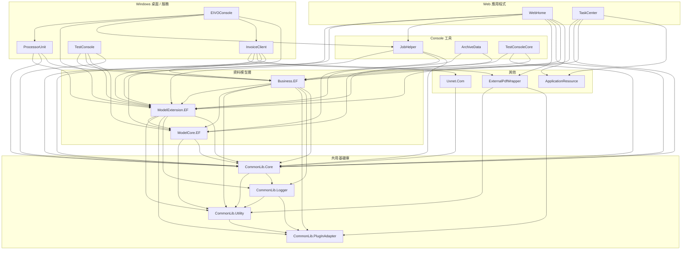

# EIVO2025 各子專案架構與功能說明

> **適用範圍**：`EIVO2025.sln` 下全部 19 個子專案  
> **版本**：1.0（2026-09-27）

---

## 專案總覽

| 專案 | 類型 | 目標框架 | 主要用途 |
|------|------|----------|----------|
| **WebHome** | ASP.NET Core MVC | net10.0 | 主 Web 應用程式（Razor Views + AJAX） |
| **TaskCenter** | ASP.NET Core Web API + SPA | net10.0 | 前後端分離 Web API + Vue 3 SPA |
| **InvoiceClient** | WinForms + Windows Service | net10.0-windows7.0 | 發票上傳/下載客戶端（PGP、PDF、POS） |
| **EIVOConsole** | WinForms Console | net10.0-windows7.0 | 批次處理主控台（結算、通知、Turnkey） |
| **ProcessorUnit** | WinForms Console | net10.0-windows | 發票處理執行器（Excel/JSON/XML 批次） |
| **TestConsole** | WinForms Console | net10.0-windows | 開發測試主控台（WCF 服務參考） |
| **JobHelper** | Console | net10.0 | PGP 加密/解密批次處理工具 |
| **ArchiveData** | Console | net10.0 | 資料歸檔工具（AutoMapper + EF Core） |
| **TestConsoleCore** | Console | net10.0 | 資料庫遷移工具（EF Core 物件圖） |
| **ModelCore.EF** | Class Library | net10.0 | EF Core 實體模型（AssemblyName: `ModelCore`） |
| **ModelExtension.EF** | Class Library | net10.0 | 業務管理器（AssemblyName: `ModelExtension`） |
| **Business.EF** | Class Library | net10.0 | 業務邏輯擴充（AssemblyName: `Business`） |
| **CommonLib.Core** | Class Library | net10.0 | 核心基礎庫（資料存取、安全、工具） |
| **CommonLib.Utility** | Class Library | net10.0 | 通用工具函式庫 |
| **CommonLib.Logger** | Class Library | net10.0 | 日誌記錄系統 |
| **CommonLib.PlugInAdapter** | Class Library | net10.0 | 外掛介面定義（PDF、Logger） |
| **ApplicationResource** | Class Library | net10.0 | 多語言資源檔 |
| **ExternalPdfWrapper** | Class Library | net10.0 | PDF 產生外掛（PuppeteerSharp / Selenium） |
| **Uxnet.Com** | Class Library | net10.0-windows7.0 | WebView2 輔助函式庫 |

---

## 相依關係圖



---

## Web 應用程式

### WebHome

| 項目 | 說明 |
|------|------|
| **路徑** | `WebHome/` |
| **類型** | ASP.NET Core MVC（`Microsoft.NET.Sdk.Web`） |
| **目標框架** | net10.0 |
| **定位** | 主 Web 應用程式，混合 Razor Views + AJAX JSON 回傳 |

**目錄結構**：

```
WebHome/
├── Program.cs              ← 入口（Host Builder + XML Serializer Formatters）
├── Startup.cs              ← DI 註冊、CORS、Session、Swagger、CoreWCF
├── Controllers/            ← MVC Controllers（~35 個）
│   ├── AuthApiController.cs
│   ├── InvoiceBusinessController.cs
│   ├── InvoiceQueryController.cs
│   ├── OrganizationController.cs
│   ├── TrackCodeController.cs
│   ├── WinningNumberController.cs
│   ├── POSDeviceController.cs
│   ├── Accounting/
│   ├── Merchandise/
│   ├── SAM/
│   ├── TrackCodeNo/
│   ├── Filters/
│   └── Handler/
├── Components/             ← Razor Components
├── Infrastructure/
│   ├── BackgroundTasks/
│   ├── ModelBinding/       ← [FromJsonOrForm] 自訂 ModelBinder
│   └── XmlDocumentModelBinderProvider.cs
├── Helper/
├── Models/
├── Views/                  ← Razor Views（.cshtml）
├── wwwroot/
│   ├── ts/                 ← TypeScript 原始碼
│   └── scss/               ← SCSS 樣式
├── package.json            ← npm 腳本（esbuild TS 編譯）
└── tsconfig.json
```

**主要功能**：

- **發票管理**：開立、查詢、作廢、折讓、字軌管理、中獎號碼
- **組織管理**：組織、分類、角色、權限
- **使用者管理**：登入、權限、選單
- **POS 設備管理**
- **通知系統**
- **報表/匯出**
- **CoreWCF** 服務端（WCF over HTTP）
- **Swagger/OpenAPI** 文件
- **Razor Runtime Compilation**（開發時熱重載）

**关键技术**：

- Cookie Authentication + 自訂 `RoleAuthorizeAttribute`
- 角色：SYS / SELLER / BUYER / GUEST / NETWORKSELLER 等 10 種
- PDFsharp（PDF 產生）、ZXing.Net（QR Code）、GoogleAuthenticator（2FA）
- System.Linq.Dynamic.Core（動態查詢）
- TypeScript + esbuild（前端編譯管線）

**相依專案**：ApplicationResource、Business.EF、CommonLib.Core、ExternalPdfWrapper、JobHelper、ModelCore.EF、ModelExtension.EF

---

### TaskCenter

| 項目 | 說明 |
|------|------|
| **路徑** | `TaskCenter/` |
| **類型** | ASP.NET Core Web API + SPA（`Microsoft.NET.Sdk.Web`） |
| **目標框架** | net10.0 |
| **定位** | 前後端分離架構的 Web API + Vue 3 SPA（新架構） |

**目錄結構**：

```
TaskCenter/
├── Program.cs              ← 入口
├── Controllers/            ← MVC Controllers
│   ├── AccountController.cs
│   ├── DocumentController.cs
│   ├── InvoiceDataController.cs
│   ├── InvoiceQueryController.cs
│   ├── InvoiceServiceController.cs
│   ├── HomeController.cs
│   └── Filters/
├── Core/                   ← API 核心層
│   ├── ApiBaseController.cs
│   ├── ApiValidationResponse.cs
│   ├── CurrentUserExtensions.cs
│   ├── SysAdminOnlyAttribute.cs
│   ├── LegacyJsonInputFormatter.cs
│   ├── Attributes/
│   ├── Controllers/
│   ├── DTOs/
│   ├── Handlers/
│   ├── Interfaces/
│   ├── Mapping/
│   └── Services/
├── Helper/
├── Models/
├── ClientApp/              ← Vue 3 SPA（Vite）
│   ├── src/
│   ├── public/
│   ├── package.json
│   └── vite.config.js
├── Views/
└── wwwroot/
```

**主要功能**：

- **JWT Bearer 認證**（`Microsoft.AspNetCore.Authentication.JwtBearer`）
- **RESTful API**（發票、文件、查詢、服務）
- **Vue 3 SPA**（Vite + TypeScript）
- **Swagger/OpenAPI**
- **ClosedXML**（Excel 匯入/匯出）
- **SPA Services**（開發時代理）

**关键技术**：

- JWT 認證（IdentityModel 8.14.0 版本鎖定，避免 MissingMethodException）
- `ApiBaseController` 統一 API 回傳格式
- `SysAdminOnlyAttribute` 權限控制
- `LegacyJsonInputFormatter` 相容舊版 JSON 格式
- Vue 3 + Vite（前端）

**相依專案**：ApplicationResource、Business.EF、CommonLib.Core、ModelExtension.EF

---

## Windows 桌面 / 服務

### InvoiceClient

| 項目 | 說明 |
|------|------|
| **路徑** | `InvoiceClient/` |
| **類型** | WinForms + Windows Service（`Microsoft.NET.Sdk`） |
| **目標框架** | net10.0-windows7.0 |
| **定位** | 發票上傳/下載客戶端，支援 PGP 加密、PDF 產生、POS 整合 |

**目錄結構**：

```
InvoiceClient/
├── Program.cs              ← 入口（WinForms / Windows Service 雙模式）
├── MainForm.cs             ← 主視窗（WinForms）
├── InvoiceClientService.cs ← Windows Service 實作
├── ProjectInstaller.cs     ← Service 安裝器
├── Agent/                  ← 核心代理（Watcher / TransferManager）
│   ├── InvoiceWatcher.cs
│   ├── InvoiceWatcherV2.cs
│   ├── InvoiceWatcherForGoogle.cs
│   ├── B2BInvoiceWatcher.cs
│   ├── B2CInvoiceTransferManager.cs
│   ├── CsvInvoiceWatcher.cs
│   ├── XlsxInvoiceWatcher.cs
│   ├── InvoicePDFGenerator.cs
│   ├── InvoicePGPWatcherForGoogle.cs
│   ├── POSHelper/
│   ├── TurnkeyProcess/
│   ├── CsvRequestHelper/
│   ├── JsonHelper/
│   ├── MIGHelper/
│   ├── MIGReviser/
│   ├── RuntimeHelper/
│   └── TurnkeyCSVHelper/
├── TransferManagement/     ← 傳輸管理器
│   ├── B2BInvoiceTransferManager.cs
│   ├── B2CInvoiceTransferManager.cs
│   ├── CsvInvoiceTransferManager.cs
│   ├── InvoiceTransferManagerV2.cs
│   ├── InvoiceTransferManagerV2ForGoogle.cs
│   ├── POSInvoiceTransferManager.cs
│   ├── PhysicalChannelTransferManager.cs
│   ├── MIGInvoiceTransferManagerV2.cs
│   └── ...
├── DTOs/
├── Helper/
├── MainContent/
├── Properties/
├── pgp_encrypt.bat / pgp_decrypt.bat
├── CreatePDF.bat / ZipPDF.bat / ZipOutput.bat
└── Init.bat
```

**主要功能**：

- **發票上傳**：監控資料夾，偵測新發票檔案（CSV/XLSX/XML/JSON），上傳至伺服器
- **發票下載**：從伺服器下載發票/折讓/作廢通知
- **PGP 加密/解密**：使用 GPG 對發票資料加密傳輸
- **PDF 產生**：將發票內容轉為 PDF（透過 ExternalPdfWrapper）
- **POS 整合**：POS 設備發票處理
- **Google 整合**：Google Play / AdWords / Express 發票處理
- **MIG 整合**：MIG（Mobile Internet Gateway）發票處理
- **Windows Service 模式**：可作為背景服務執行（TopShelf.ServiceInstaller）
- **雙模式執行**：互動式 WinForms 或背景 Service

**关键技术**：

- TopShelf.ServiceInstaller（Windows Service 安裝）
- PGP/GPG 加密（外部 .bat 腳本呼叫）
- 資料夾監控（Watcher 模式）
- 多格式支援：CSV / XLSX / XML / JSON
- SSL 憑證信任設定（`ServicePointManager.ServerCertificateValidationCallback`）

**相依專案**：Business.EF、CommonLib.Core、ExternalPdfWrapper、ModelExtension.EF、Uxnet.Com

---

### EIVOConsole

| 項目 | 說明 |
|------|------|
| **路徑** | `EIVOConsole/` |
| **類型** | WinForms Console（`Microsoft.NET.Sdk`） |
| **目標框架** | net10.0-windows7.0 |
| **定位** | 批次處理主控台（結算、通知、Turnkey 處理） |

**目錄結構**：

```
EIVOConsole/
├── Program.cs              ← 入口（命令列參數分派）
├── MyApplicationContext.cs ← WinForms ApplicationContext
└── Properties/
```

**主要功能**：

- **空白發票號結算**（`001` 命令）：處理前期未使用發票號結算
- **設定值顯示**（`settings` 命令）：顯示所有專案的 AppSettings
- **ProcessorUnit 執行**（`pu` 命令）：啟動發票處理執行器
- **Turnkey 通知**：`EIVOTurnkeyFactory.Notify()`
- **EIVO 通知**：`EIVONotificationFactory.Notify()`
- **Turnkey Log 檢查**：`CheckTurnkeyLog.Notify()`
- **Turnkey 傳輸管理**：`TurnkeyProcessTransferManager`

**命令列參數**：

| 參數 | 說明 |
|------|------|
| `001 [year] [period] [sellerId]` | 執行前期空白發票號結算 |
| `settings` | 顯示目前設定值 |
| `pu [args]` | 執行 ProcessorUnit |
| （無參數） | 執行 Turnkey 通知 + 傳輸管理 |

**相依專案**：CommonLib.Core、InvoiceClient、JobHelper、ModelExtension.EF、ProcessorUnit

---

### ProcessorUnit

| 項目 | 說明 |
|------|------|
| **路徑** | `ProcessorUnit/` |
| **類型** | WinForms Console（`Microsoft.NET.Sdk`） |
| **目標框架** | net10.0-windows |
| **定位** | 發票處理執行器（Excel/JSON/XML 批次處理） |

**目錄結構**：

```
ProcessorUnit/
├── Program.cs              ← 入口（InitializeApp.StartUp）
├── Execution/              ← 處理器實作
│   ├── ExecutorForeverBase.cs          ← 處理器基類（無限循環）
│   ├── InvoiceExcelRequestProcessor.cs
│   ├── InvoiceExcelRequestForCBEProcessor.cs
│   ├── InvoiceExcelRequestForVACProcessor.cs
│   ├── InvoiceExcelRequestForIssuerProcessor.cs
│   ├── InvoiceExcelRequestForIssuerA0101Processor.cs
│   ├── InvoiceJsonRequestForCBEProcessor.cs
│   ├── InvoiceXmlRequestForCBEProcessor.cs
│   ├── AllowanceExcelRequestProcessor.cs
│   ├── AllowanceJsonRequestProcessor.cs
│   ├── FullAllowanceExcelRequestProcessor.cs
│   ├── VoidInvoiceExcelRequestProcessor.cs
│   ├── VoidInvoiceJsonRequestProcessor.cs
│   ├── VoidAllowanceExcelRequestProcessor.cs
│   ├── DataReportProcessor.cs
│   ├── ProcessExceptionNotificationProcessor.cs
│   ├── UnassignedInvoiceNOSettlementProcessor.cs
│   ├── ProcessRequestExecutorForever.cs
│   └── AutoUpdater.cs
├── Helper/
└── Properties/
```

**主要功能**：

- **發票批次處理**：監控 `ProcessRequestQueue`，處理 Excel/JSON/XML 格式的發票請求
- **處理器鏈（ChainedExecutor）**：處理器以鏈式結構串接，依序處理不同類型的請求
- **折讓處理**：Allowance Excel/JSON 請求處理
- **作廢處理**：Void Invoice/Allowance 請求處理
- **資料報表**：DataReportProcessor
- **例外通知**：ProcessExceptionNotificationProcessor
- **未分配發票號結算**：UnassignedInvoiceNOSettlementProcessor
- **自動更新**：AutoUpdater

**處理器鏈順序**：

```
InvoiceExcelRequestProcessor
  → InvoiceExcelRequestForCBEProcessor
    → InvoiceExcelRequestForVACProcessor
      → InvoiceExcelRequestForIssuerProcessor
        → InvoiceExcelRequestForIssuerA0101Processor
          → VoidInvoiceExcelRequestProcessor
            → AllowanceExcelRequestProcessor
              → VoidAllowanceExcelRequestProcessor
```

**关键技术**：

- `ExecutorForeverBase`：無限循環處理器基類
- `ChainedExecutor` 模式：處理器鏈式串接
- `ModelSource<T>`：EF Core 資料存取
- `RegisterProcessorUnit`：處理器註冊

**相依專案**：Business.EF、CommonLib.Core、ModelExtension.EF

---

### TestConsole

| 項目 | 說明 |
|------|------|
| **路徑** | `TestConsole/` |
| **類型** | WinForms Console（`Microsoft.NET.Sdk`） |
| **目標框架** | net10.0-windows |
| **定位** | 開發測試用主控台（WCF 服務參考、B2B 測試） |

**目錄結構**：

```
TestConsole/
├── Program.cs              ← 入口
├── Class1.cs / Class2.cs   ← 測試類別
├── Connected Services/     ← WCF 服務參考
│   └── ServiceReference1/
│       ├── Reference.cs
│       └── *.datasource    ← B2B 回應資料來源
├── Helper/
├── Models/
└── Properties/
```

**主要功能**：

- **WCF 服務測試**：B2B 發票上傳/下載、折讓、作廢
- **B2B 測試**：`B2BUploadInvoice`、`B2BUploadAllowance`、`B2BReceiveA0501` 等
- **B2C 測試**：`B2CUploadInvoice`、`B2CUploadInvoiceCancellation`
- **發票查詢**：`GetIncomingInvoices`、`GetIncomingAllowances`
- **字軌管理**：`GetCurrentYearInvoiceTrackCode`
- **PDF 測試**：`DeleteTempForReceivePDF`
- **MailKit**：SMTP 郵件測試

**关键技术**：

- WCF Connected Services（`System.ServiceModel`）
- MailKit / MimeKit（SMTP 郵件）
- ClosedXML（Excel）
- System.Data.Linq（LINQ to SQL）

**相依專案**：CommonLib.Core、ModelCore.EF、ModelExtension.EF、Business.EF

---

## Console 工具

### JobHelper

| 項目 | 說明 |
|------|------|
| **路徑** | `JobHelper/` |
| **類型** | Console（`Microsoft.NET.Sdk`） |
| **目標框架** | net10.0 |
| **定位** | PGP 加密/解密批次處理工具 |

**目錄結構**：

```
JobHelper/
├── Program.cs              ← 入口（命令列參數分派）
├── Tasks/
│   └── CheckTurnkeyLog.cs  ← Turnkey Log 檢查
├── pgp_encrypt.bat         ← PGP 加密批次腳本
├── pgp_decrypt.bat         ← PGP 解密批次腳本
├── Startup.bat             ← 啟動批次腳本
└── Properties/
```

**主要功能**：

- **PGP 解密**（`1` 命令）：解密 `.gpg` / `.pgp` 檔案
- **準備請求檔案**（`2` 命令）：將 XML 檔案分類至對應請求類型資料夾
- **擷取回應**（`3` 命令）：將回應/失敗檔案加密並移至 Ready 資料夾
- **Turnkey Log 檢查**：`CheckTurnkeyLog.Notify()`

**命令列參數**：

| 參數 | 說明 |
|------|------|
| `1` | 解密 PGP 檔案 |
| `2` | 準備請求檔案 |
| `3` | 擷取回應 |

**关键技术**：

- 外部 GPG 命令（`CommandEncryptGPG` / `CommandDecryptGPG`）
- 批次腳本產生（`.bat` 檔案）
- 資料夾監控與檔案分類

**相依專案**：CommonLib.Core、ModelCore.EF、ModelExtension.EF

---

### ArchiveData

| 項目 | 說明 |
|------|------|
| **路徑** | `ArchiveData/` |
| **類型** | Console（`Microsoft.NET.Sdk`） |
| **目標框架** | net10.0 |
| **定位** | 資料歸檔工具（AutoMapper + EF Core） |

**目錄結構**：

```
ArchiveData/
├── Program.cs              ← 入口（命令列參數分派）
├── Mapping/                ← AutoMapper Profile
└── Properties/
```

**主要功能**：

- **發票資料歸檔**：將發票資料從主資料庫歸檔至歸檔資料庫
- **AutoMapper**：Entity ↔ DTO 映射
- **批次處理**：支援 `-n`（任務數量）、`-min` / `-max`（ID 範圍）、`-seller`（賣方 ID）參數
- **文件刪除**：`-deleteDoc` 選項

**命令列參數**：

| 參數 | 說明 |
|------|------|
| `-o <path>` | 輸出路徑 |
| `-n <count>` | 任務數量 |
| `-min <id>` | 最小 ID |
| `-max <id>` | 最大 ID |
| `-seller <id>` | 賣方 ID |
| `-deleteDoc` | 刪除文件 |

**关键技术**：

- AutoMapper 16.1.0
- EF Core 10.0.5
- 批次資料處理

**相依專案**：ModelCore.EF、ModelExtension.EF

---

### TestConsoleCore

| 項目 | 說明 |
|------|------|
| **路徑** | `TestConsoleCore/` |
| **類型** | Console（`Microsoft.NET.Sdk`） |
| **目標框架** | net10.0 |
| **定位** | 資料庫遷移工具（EF Core 物件圖串接） |

**目錄結構**：

```
TestConsoleCore/
├── Program.cs              ← 入口（命令列參數分派）
└── Properties/
```

**主要功能**：

- **發票資料遷移**：將發票資料從來源資料庫遷移至目的資料庫
- **EF Core 物件圖串接**：自動處理 Identity 主鍵重新產生
- **外鍵對應**：以 `ReceiptNo`（統編）對應目的端的 `Organization.CompanyID`

**命令列參數**：

| 參數 | 說明 |
|------|------|
| `InvoiceItem <srcConn> <destConn>` | 遷移 InvoiceItem 及關聯實體 |
| `InvoiceCancellation <srcConn> <destConn>` | 遷移 InvoiceCancellation |
| `InvoiceAllowance <srcConn> <destConn>` | 遷移 InvoiceAllowance |

**关键技术**：

- EF Core 物件圖串接新增（Object Graph）
- Identity 主鍵自動重新產生
- 外鍵對應邏輯（ReceiptNo → CompanyID）

**相依專案**：Business.EF、CommonLib.Core、ModelExtension.EF

---

## 資料模型層

### ModelCore.EF

| 項目 | 說明 |
|------|------|
| **路徑** | `ModelCore.EF/` |
| **類型** | Class Library（`Microsoft.NET.Sdk`） |
| **目標框架** | net10.0 |
| **AssemblyName** | `ModelCore` |
| **RootNamespace** | `ModelCore` |
| **定位** | EF Core 實體模型（核心資料層） |

**目錄結構**：

```
ModelCore.EF/
├── DataEntity/             ← EF Core 實體（~150 個）
│   ├── ApplicationDbContext.cs
│   ├── InvoiceItem.cs
│   ├── InvoiceSeller.cs
│   ├── InvoiceBuyer.cs
│   ├── InvoiceAllowance.cs
│   ├── InvoiceCancellation.cs
│   ├── InvoiceTrackCode.cs
│   ├── Organization.cs
│   ├── UserProfile.cs
│   ├── UserRole.cs
│   ├── DocumentFlow.cs
│   ├── ProcessRequest.cs
│   ├── CDS_Document.cs
│   └── ...
├── DataEntityWrapper/      ← 實體包裝器
├── DTOs/                   ← DTO
│   ├── BaseDto.cs
│   ├── OrganizationCategoryDto.cs
│   ├── ProductCatalogDto.cs
│   ├── QueryDto.cs
│   ├── UserProfileDto.cs
│   └── UserRoleDto.cs
├── Models/                 ← 模型
│   ├── InvoiceNumberApply.cs
│   └── ViewModel/
├── TurnkeyModel/           ← Turnkey 模型
│   ├── TurnkeyDbContext.cs
│   ├── DocumentDispatchQueue.cs
│   ├── TURNKEY_MESSAGE_LOG.cs
│   ├── V_Invoice.cs
│   ├── V_Allowance.cs
│   └── ...
├── BaseManagement/         ← 基礎管理
│   └── IManager.cs
├── ModelTemplate/          ← 模型範本
│   └── EIVOEntityManager.cs
├── Helper/
├── Locale/                 ← 多語言
├── Resource/
├── Schema/                 ← XSD Schema
│   └── dsUserProfile.xsd
└── Properties/
```

**主要功能**：

- **EF Core 實體模型**：~150 個實體類別，對應 EIVO03 資料庫
- **ApplicationDbContext**：EF Core DbContext
- **TurnkeyDbContext**：Turnkey 資料庫 DbContext
- **DTO**：資料傳輸物件
- **ViewModel**：檢視模型
- **XSD Schema**：XML Schema 定義

**主要實體分類**：

| 分類 | 實體 |
|------|------|
| **發票核心** | InvoiceItem、InvoiceSeller、InvoiceBuyer、InvoiceProduct、InvoiceProductItem、InvoiceAmountType |
| **折讓/作廢** | InvoiceAllowance、InvoiceAllowanceItem、InvoiceCancellation、InvoiceAllowanceCancellation |
| **字軌管理** | InvoiceTrackCode、InvoiceTrackCodeAssignment、InvoiceNoAllocation、InvoiceNoSegment |
| **中獎號碼** | InvoiceWinningNumber、UniformInvoiceWinningNumber、InvoicePrizeWinningNumbers |
| **組織管理** | Organization、OrganizationCategory、OrganizationBranch、OrganizationDepartment |
| **使用者管理** | UserProfile、UserRole、UserRoleDefinition、UserMenu、MenuControl |
| **文件流程** | DocumentFlow、DocumentFlowStep、DocumentFlowBranch、DocumentFlowControl |
| **處理請求** | ProcessRequest、ProcessRequestQueue、ProcessRequestType、ProcessRequestCondition |
| **計費** | BillingGrade、BillingIncrement、MonthlyBilling、Settlement |
| **通知** | SystemMessage、SMSNotificationQueue、ProcessCompletionNotification |
| **POS** | POSDevice、POSInvoiceNoSegment |
| **Turnkey** | TurnkeyDbContext、DocumentDispatchQueue、TURNKEY_MESSAGE_LOG |

**关键技术**：

- EF Core 10.0.5（Database-First scaffolding）
- EF Core Proxies（延遲載入）
- CsvHelper 33.1.0（CSV 處理）
- XSD Schema（XML 驗證）

**相依專案**：CommonLib.Core、CommonLib.Utility

---

### ModelExtension.EF

| 項目 | 說明 |
|------|------|
| **路徑** | `ModelExtension.EF/` |
| **類型** | Class Library（`Microsoft.NET.Sdk`） |
| **目標框架** | net10.0 |
| **AssemblyName** | `ModelExtension` |
| **RootNamespace** | `ModelCore` |
| **定位** | 業務管理器（發票、文件、通知、上傳、資料交換） |

**目錄結構**：

```
ModelExtension.EF/
├── InvoiceManagement/      ← 發票管理
│   ├── InvoiceManager.cs
│   ├── InvoiceManagerV2.cs
│   ├── InvoiceManagerV3.cs
│   ├── InvoiceManagerForCBE.cs
│   ├── B2BInvoiceManager.cs
│   ├── B2CInvoiceManager.cs
│   ├── GoogleInvoiceManager.cs
│   ├── GoogleInvoiceManagerV2.cs
│   ├── GoogleInvoiceManagerV3.cs
│   ├── GooglePlayInvoiceManager.cs
│   ├── GoogleUploadManager.cs
│   ├── IGoogleInvoiceUploadManager.cs
│   ├── InvoiceDataSetManager.cs
│   ├── AllowanceDataSetManager.cs
│   ├── FullAllowanceDataSetManager.cs
│   ├── VoidInvoiceDataSetManager.cs
│   ├── VoidAllowanceDataSetManager.cs
│   ├── InvoiceEnterpriseManager.cs
│   ├── EIVOPlatformManager.cs
│   ├── EIVOTurnkeyFactory.cs
│   ├── EIVONotificationFactory.cs
│   ├── TrackNoManager.cs
│   ├── TrackNoIntervalManager.cs
│   ├── VacantInvoiceNoProcessor.cs
│   ├── AttachmentManager.cs
│   ├── InvoiceProcess/
│   ├── Validator/
│   ├── ErrorHandle/
│   ├── enUS/
│   └── zhTW/
├── DataExchange/           ← 資料交換
│   ├── CounterpartBusinessExchange.cs
│   ├── InvoiceBuyerExchange.cs
│   └── TrackCodeExchange.cs
├── DocumentManagement/     ← 文件管理
│   └── ReceiptManager.cs
├── UploadManagement/       ← 上傳管理
│   ├── CsvUploadManager.cs
│   ├── ICsvUploadManager.cs
│   ├── IUploadManager.cs
│   └── XmlUploadManager.cs
├── MessageManagement/      ← 訊息管理
│   ├── ExtensionMethods.cs
│   ├── InvoiceNotificationManager.cs
│   ├── InvoiceWinningNotificationManager.cs
│   └── SMSHelper.cs
├── Notification/           ← 通知
│   └── PortalNotification.cs
├── Security/               ← 安全
│   ├── AuthorityExtensions.cs
│   └── MembershipManagement/
├── Service/                ← 服務
│   ├── InvoiceBusiness.cs
│   └── PdfDocumentGenerator.cs
├── Models/                 ← 模型
│   ├── InquireField.cs
│   ├── InvoiceNumberApplyService.cs
│   ├── Persistence/
│   └── ViewModel/
├── ProcessorUnitHelper/
├── Helper/
├── Connected Services/
└── Properties/
```

**主要功能**：

- **發票管理**：多版本發票管理器（V1/V2/V3）、B2B/B2C、Google 整合
- **DataSet 管理器**：發票/折讓/作廢資料集管理
- **字軌管理**：TrackNoManager、TrackNoIntervalManager、VacantInvoiceNoProcessor
- **資料交換**：相對營業人、買受人、字軌交換
- **文件管理**：ReceiptManager
- **上傳管理**：CSV/XML 上傳管理器
- **訊息管理**：發票通知、中獎通知、SMS
- **安全**：權限擴充、會員管理
- **PDF 文件產生**：PdfDocumentGenerator
- **Turnkey 工廠**：EIVOTurnkeyFactory、EIVONotificationFactory

**关键技术**：

- System.ServiceModel（WCF：Duplex、Federation、Http、NetTcp、Security）
- ClosedXML（Excel）
- 多語言（enUS / zhTW）
- 外部 DLL：MessagingToolkit.QRCode、QREncrypter、ThoughtWorks.QRCode

**相依專案**：CommonLib.Core、CommonLib.Logger、CommonLib.PlugInAdapter、CommonLib.Utility、ModelCore.EF

---

### Business.EF

| 項目 | 說明 |
|------|------|
| **路徑** | `Business.EF/` |
| **類型** | Class Library（`Microsoft.NET.Sdk`） |
| **目標框架** | net10.0 |
| **AssemblyName** | `Business` |
| **定位** | 業務邏輯擴充（發票處理、流程請求、報表、計費結算） |

**目錄結構**：

```
Business.EF/
├── Helper/
│   ├── InvoiceProcessor/
│   │   └── InvoiceManagerExtensions.cs
│   ├── ProcessRequestProcessor/
│   │   └── ProcessRequestExtensions.cs
│   ├── ReportProcessor/
│   │   └── InvoiceDataReportExtensions.cs
│   └── BillingSettlement/
│       └── ExtensionMethods.cs
└── Properties/
```

**主要功能**：

- **發票處理擴充**：`InvoiceManagerExtensions`（發票管理器擴充方法）
- **流程請求處理**：`ProcessRequestExtensions`（流程請求擴充方法）
- **報表處理**：`InvoiceDataReportExtensions`（發票資料報表擴充方法）
- **計費結算**：`ExtensionMethods`（計費結算擴充方法）

**定位說明**：

Business.EF 為輕量級的業務邏輯擴充層，以 Extension Methods 模式擴充 ModelExtension.EF 中的管理器，提供發票處理、流程請求、報表、計費結算等高階業務邏輯。

**相依專案**：CommonLib.Core、CommonLib.Logger、CommonLib.PlugInAdapter、CommonLib.Utility、ModelCore.EF、ModelExtension.EF

---

## 共用基礎庫

### CommonLib.Core

| 項目 | 說明 |
|------|------|
| **路徑** | `CommonLib.Core/` |
| **類型** | Class Library（`Microsoft.NET.Sdk.Web`） |
| **目標框架** | net10.0 |
| **RootNamespace** | `CommonLib.Core` |
| **定位** | 核心基礎庫（資料存取、安全、工具、ASP.NET MVC 擴充） |

**目錄結構**：

```
CommonLib.Core/
├── Startup.cs              ← ASP.NET Core 啟動擴充
├── AspNetMvc/
│   └── JavaScriptResult.cs ← MVC JavaScriptResult 擴充
├── Controllers/            ← 共用 Controller
├── DataAccess/             ← 資料存取
├── DataWork/               ← 資料工作
│   ├── ExtensionMethods.cs
│   ├── GenericEntityRepository.cs
│   ├── GenericManager.cs
│   ├── IGenericEntityRepository.cs
│   ├── IGenericDbContext.cs
│   ├── ModelSource.cs
│   └── SQLHelper.cs
├── Helper/
├── Security/               ← 安全
│   └── UseCrypto/          ← 加密（dsPKCS7.xsd）
├── Utility/                ← 工具
│   ├── CsvSerializer.cs
│   ├── DailySequence.cs
│   ├── ExtensionMethods.cs
│   ├── FileLogger.cs
│   ├── FileLoggerFactory.cs
│   ├── FileLoggerProvider.cs
│   ├── Logger.cs
│   └── ViewRenderService.cs
└── Properties/
```

**主要功能**：

- **資料存取**：`GenericEntityRepository`、`GenericManager`、`ModelSource<T>`、`SQLHelper`
- **通用 Repository**：`IGenericEntityRepository<T>`、`IGenericDbContext`
- **安全/加密**：UseCrypto（PKCS7 加密）
- **工具**：CSV 序列化、每日序號、檔案日誌、檢視渲染
- **ASP.NET MVC 擴充**：JavaScriptResult、ViewRenderService
- **FileLogger**：自訂 ILoggerProvider（供 ASP.NET Core 使用）

**关键技术**：

- EF Core 10.0.5（Relational、SqlServer、Tools）
- EntityFramework 6.5.1（EF6 相容）
- netstandard-System.Data.Linq（LINQ to SQL 相容）
- System.Data.SqlClient
- ClosedXML（Excel）
- HtmlAgilityPack（HTML 解析）
- Microsoft.Windows.Compatibility

**相依專案**：CommonLib.Logger、CommonLib.Utility

---

### CommonLib.Utility

| 項目 | 說明 |
|------|------|
| **路徑** | `CommonLib.Utility/` |
| **類型** | Class Library（`Microsoft.NET.Sdk`） |
| **目標框架** | net10.0 |
| **RootNamespace** | `CommonLib` |
| **定位** | 通用工具函式庫 |

**目錄結構**：

```
CommonLib.Utility/
├── Utility/
│   ├── BigInteger.cs
│   ├── CipherDecipherSrv.cs      ← 加密/解密服務
│   ├── ExtensionMethods.cs
│   ├── PredicateBuilder.cs       ← LINQ 預測建構器
│   ├── ValidityAgent.cs
│   ├── WebClientEx.cs            ← WebClient 擴充
│   └── XmlLinqConvertionExtensions.cs
├── Helper/
│   └── QueuedProcessHandler.cs   ← 佇列處理
└── Properties/
```

**主要功能**：

- **加密/解密**：`CipherDecipherSrv`
- **LINQ 預測建構器**：`PredicateBuilder`（動態 WHERE 條件）
- **WebClient 擴充**：`WebClientEx`
- **XML LINQ 轉換**：`XmlLinqConvertionExtensions`
- **大數運算**：`BigInteger`
- **佇列處理**：`QueuedProcessHandler`
- **有效性驗證**：`ValidityAgent`

**关键技术**：

- Newtonsoft.Json 13.0.4

**相依專案**：CommonLib.PlugInAdapter

---

### CommonLib.Logger

| 項目 | 說明 |
|------|------|
| **路徑** | `CommonLib.Logger/` |
| **類型** | Class Library（`Microsoft.NET.Sdk`） |
| **目標框架** | net10.0 |
| **定位** | 日誌記錄系統 |

**目錄結構**：

```
CommonLib.Logger/
├── Logger.cs              ← 主日誌類別（實作 ILogger）
├── LoggerBase.cs          ← 日誌基類
├── LogWriter.cs          ← 日誌寫入器
├── app.config
└── Properties/
```

**主要功能**：

- **多級別日誌**：Debug / Info / Error / Warn / Trace
- **多檔案寫入**：`SystemLog_{PID}.dbg` / `.err` / `.nfo` / `.wrn` / `.trace`
- **OutputWriter**：可附加額外輸出（如 Console）
- **LogDailyPath / LogPath**：日誌路徑管理
- **IDisposable**：資源釋放

**关键技术**：

- System.Configuration.ConfigurationManager
- 實作 `CommonLib.PlugInAdapter.ILogger` 介面

**相依專案**：CommonLib.PlugInAdapter、CommonLib.Utility

---

### CommonLib.PlugInAdapter

| 項目 | 說明 |
|------|------|
| **路徑** | `CommonLib.PlugInAdapter/` |
| **類型** | Class Library（`Microsoft.NET.Sdk`） |
| **目標框架** | net10.0 |
| **定位** | 外掛介面定義（PDF、Logger） |

**目錄結構**：

```
CommonLib.PlugInAdapter/
└── PlugInAdapter.cs      ← 介面定義
```

**主要功能**：

- **IPdfUtility**：PDF 轉換介面（`ConvertHtmlToPDF`）
- **ILogger**：日誌介面（Debug / Info / Error / Warn、LogDailyPath、LogPath、OutputWriter）
- **ILogObject**：日誌物件介面（Subject、ToString）
- **ILogObject2**：延伸日誌物件介面（GetFileName）

**定位說明**：

CommonLib.PlugInAdapter 為最底層的介面定義專案，定義 PDF 與 Logger 的抽象介面，供其他專案（ExternalPdfWrapper、CommonLib.Logger）實作，達到解耦目的。

**相依專案**：（無）

---

## 其他

### ApplicationResource

| 項目 | 說明 |
|------|------|
| **路徑** | `ApplicationResource/` |
| **類型** | Class Library（`Microsoft.NET.Sdk`） |
| **目標框架** | net10.0 |
| **定位** | 多語言資源檔（錯誤訊息、流程訊息） |

**目錄結構**：

```
ApplicationResource/
├── ErrorMessage.resx / ErrorMessage.en-US.resx
├── ErrorMessage.Designer.cs
├── ProcessMessage.resx / ProcessMessage.en-US.resx
├── ProcessMessage.Designer.cs
└── ProcessMessage.en-US.Designer.cs
```

**主要功能**：

- **ErrorMessage**：錯誤訊息多語言資源
- **ProcessMessage**：流程訊息多語言資源
- **多語言**：預設 + en-US

**相依專案**：（無）

---

### ExternalPdfWrapper

| 項目 | 說明 |
|------|------|
| **路徑** | `ExternalPdfWrapper/` |
| **類型** | Class Library（`Microsoft.NET.Sdk`） |
| **目標框架** | net10.0 |
| **定位** | PDF 產生外掛（PuppeteerSharp / Selenium） |

**目錄結構**：

```
ExternalPdfWrapper/
├── PdfUtility.cs             ← PDF 工具（實作 IPdfUtility）
├── PuppeteerSharpUtility.cs  ← PuppeteerSharp 實作
└── Properties/
```

**主要功能**：

- **HTML 轉 PDF**：`ConvertHtmlToPDF`（實作 `IPdfUtility` 介面）
- **PuppeteerSharp**：Headless Chrome PDF 產生
- **Selenium WebDriver**：ChromeDriver PDF 產生（備援）

**关键技术**：

- PuppeteerSharp 24.39.0（Headless Chrome）
- Selenium.WebDriver 4.41.0 + ChromeDriver 146
- Newtonsoft.Json
- Microsoft.Bcl.AsyncInterfaces

**相依專案**：CommonLib.PlugInAdapter、CommonLib.Utility

---

### Uxnet.Com

| 項目 | 說明 |
|------|------|
| **路徑** | `Uxnet.Com/` |
| **類型** | Class Library（`Microsoft.NET.Sdk`） |
| **目標框架** | net10.0-windows7.0 |
| **定位** | WebView2 輔助函式庫 |

**目錄結構**：

```
Uxnet.Com/
├── Helper/
│   └── DefaultTools/
│       ├── PdfUtility.cs
│       └── Program.cs
├── Win32/
└── Properties/
```

**主要功能**：

- **WebView2 整合**：Microsoft.Web.WebView2
- **PDF 工具**：PdfUtility
- **Win32 API**：原生 Windows API 呼叫

**关键技术**：

- Microsoft.Web.WebView2 1.0.3800.47
- Windows Forms

**相依專案**：CommonLib.Core
